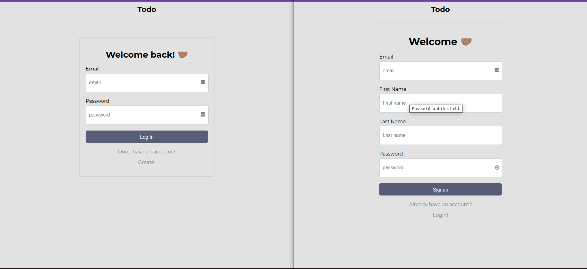
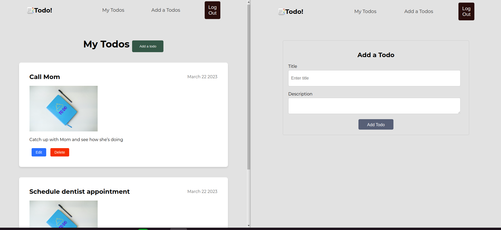

<h1 align="center">Todo App</h1>
- This is a simple user interface for a todo app built using react.

## <h2 align="center">App Screenshots</h2>
## <h3 align="center">Login and Signup</h3>


## <h3 align="center">Add form and List of Todos</h3>


## Features
- User can Login/Signup.
- User can have personalized projects after login/signup.
- User can add new todo project to their todos list.
- User can update and delete existing todo.

## How to run the app locally
```
- git clone git@github.com:Barsu5489/Todo-UserInterface.git
- cd Todo-UserInterface
- npm install
- npm start
- Open the app on your web browser at http://localhost:4000.
```

## Usage
- Upon landing on Home page click on `Get started`
- Log in if you have an account or signup by clicking on `create` link at the footer of login form.
- After succesful signup and login, use the navbar for navigation through the application.
- Click on `My Todos` - You can add new todo project/task by clicking on `add todos` button.
## Copyright
- Owner [Emmanuel Kipkemboi Barsulai]
- Github [https://github.com/Barsu5489]
- (c) 2023, All rights reserved.
